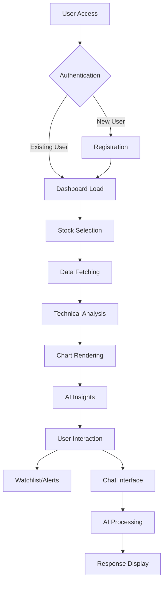

# StockGuru - Workflow & Architecture Design Document

## Table of Contents
1. [Application Workflows](#application-workflows)
2. [Data Flow Architecture](#data-flow-architecture)
3. [User Journey Workflows](#user-journey-workflows)
4. [AI Processing Workflows](#ai-processing-workflows)
5. [Integration Workflows](#integration-workflows)
6. [Development Workflows](#development-workflows)
7. [Deployment Workflows](#deployment-workflows)

## Application Workflows

### Core Application Flow



### Real-time Data Update Workflow

```
Market Open Check → API Health Check → Data Fetch Scheduler → Processing Pipeline → Cache Update → UI Refresh
     ↓                    ↓                    ↓                    ↓              ↓            ↓
   6:00 AM            Every 30s          Every 1min         Parallel Calc    Memory Store   WebSocket
```

## Data Flow Architecture

### Frontend Data Flow

```typescript
// Data flow pattern
interface DataFlowPattern {
  trigger: UserAction | Timer | WebSocket;
  query: TanStackQuery;
  cache: ClientCache;
  state: ReactState;
  ui: ComponentUpdate;
}

// Example: Stock data flow
const stockDataFlow = {
  trigger: 'USER_SELECTS_STOCK',
  query: useQuery(['stock', symbol]),
  cache: 'stale-while-revalidate',
  state: 'loading → success → display',
  ui: 'chart-update → indicators-update → insights-update'
};
```

### Backend Data Flow

```typescript
// Service layer workflow
class WorkflowOrchestrator {
  async processStockRequest(symbol: string): Promise<StockData> {
    // 1. Validate input
    const validatedSymbol = this.validateSymbol(symbol);
    
    // 2. Check cache
    const cachedData = await this.checkCache(validatedSymbol);
    if (cachedData && !this.isStale(cachedData)) {
      return cachedData;
    }
    
    // 3. Fetch external data
    const externalData = await this.fetchExternalData(validatedSymbol);
    
    // 4. Process and calculate
    const processedData = await this.processData(externalData);
    
    // 5. Store in cache
    await this.updateCache(validatedSymbol, processedData);
    
    // 6. Return result
    return processedData;
  }
}
```

### Database Transaction Workflow

```sql
-- Transaction workflow for watchlist operations
BEGIN;
  -- 1. Validate user exists
  SELECT id FROM users WHERE id = $1;
  
  -- 2. Check if stock already in watchlist
  SELECT id FROM watchlist_items 
  WHERE user_id = $1 AND symbol = $2;
  
  -- 3. Insert if not exists
  INSERT INTO watchlist_items (user_id, symbol, name)
  VALUES ($1, $2, $3)
  ON CONFLICT (user_id, symbol) DO NOTHING;
  
  -- 4. Update user preferences
  UPDATE users SET updated_at = CURRENT_TIMESTAMP 
  WHERE id = $1;
COMMIT;
```

## User Journey Workflows

### New User Onboarding Workflow

```
Landing Page → Registration → Email Verification → Profile Setup → Tutorial → Dashboard → First Stock Search → Watchlist Creation → AI Chat Demo
     ↓              ↓              ↓               ↓           ↓          ↓             ↓                ↓                 ↓
  Marketing     Form Validation  Email Service   Data Collection  Guide UI  Default View   Search API      Storage        AI Service
```

### Daily User Workflow

```
1. Morning Routine:
   Login → Check Watchlist → Review Overnight News → Market Open Alerts

2. Trading Hours:
   Stock Analysis → Technical Indicators → AI Consultation → Trading Decisions

3. Post-Market:
   Performance Review → Alert Configuration → News Reading → Strategy Planning
```

### Power User Workflow

```
1. Advanced Analysis:
   Multi-timeframe Charts → Custom Indicators → Backtesting → Portfolio Optimization

2. Integration Usage:
   API Calls → Widget Embedding → Custom Dashboards → Automated Alerts
```

## AI Processing Workflows

### Intelligent Chat Workflow (5-Step Process)

```typescript
class IntelligentChatWorkflow {
  async processQuery(userMessage: string, userId: string): Promise<ChatResponse> {
    // Step 1: Input Processing
    const processedInput = await this.preprocessInput(userMessage);
    
    // Step 2: Query Analysis
    const analysis = await this.queryAnalyzer.analyze(processedInput);
    
    // Step 3: Execution Routing
    let executionResult;
    switch (analysis.type) {
      case 'market_data':
        executionResult = await this.fetchMarketData(analysis.stockSymbols);
        break;
      case 'general_explanation':
        executionResult = await this.generateExplanation(processedInput);
        break;
      case 'mixed_query':
        executionResult = await this.handleMixedQuery(analysis, processedInput);
        break;
    }
    
    // Step 4: Response Synthesis
    const synthesizedResponse = await this.synthesizeResponse(
      executionResult, 
      analysis, 
      processedInput
    );
    
    // Step 5: Output Formatting
    return this.formatForUI(synthesizedResponse);
  }
}
```

### Query Classification Workflow

```typescript
interface QueryClassificationFlow {
  input: string;
  preprocessing: {
    tokenization: string[];
    stockSymbolExtraction: string[];
    intentRecognition: string;
  };
  classification: {
    type: 'market_data' | 'general_explanation' | 'mixed_query';
    confidence: number;
    reasoning: string;
  };
  routing: {
    services: string[];
    parameters: Record<string, any>;
  };
}
```

### AI Response Generation Workflow

```
User Query → Context Building → Prompt Engineering → LLM Call → Response Parsing → Validation → Formatting → UI Display
     ↓              ↓               ↓             ↓           ↓             ↓            ↓           ↓
 Input Text    Historical +      Template +    Groq/OpenAI  JSON Parse   Schema      Format      React
              Stock Data       Market Context    API Call    + Extract    Check      + Suggest   Component
```

## Integration Workflows

### External Website Integration Workflow

```typescript
// Widget integration sequence
class WidgetIntegrationWorkflow {
  async initializeWidget(config: WidgetConfig): Promise<void> {
    // 1. Validate configuration
    const validatedConfig = this.validateConfig(config);
    
    // 2. Create iframe or embed container
    const container = this.createContainer(validatedConfig);
    
    // 3. Establish communication channel
    const messageChannel = this.setupPostMessage();
    
    // 4. Load initial data
    const initialData = await this.loadInitialData(validatedConfig);
    
    // 5. Render interface
    this.renderInterface(container, initialData);
    
    // 6. Setup event listeners
    this.setupEventListeners(messageChannel);
  }
}
```

### API Integration Workflow

```
Client Request → Authentication → Rate Limiting → Input Validation → Service Router → External API → Data Processing → Response Formatting → Client Response
      ↓              ↓              ↓               ↓                 ↓              ↓             ↓                ↓                   ↓
   HTTP POST     Session Check   User Limits     Zod Schema       Route Match    Yahoo Finance   Transform       JSON Format        HTTP 200
```

### Webhook Integration Workflow

```typescript
// Webhook processing for external integrations
class WebhookProcessor {
  async processIncomingWebhook(payload: WebhookPayload): Promise<void> {
    // 1. Verify signature
    const isValid = await this.verifySignature(payload);
    
    // 2. Parse payload
    const parsedData = this.parsePayload(payload);
    
    // 3. Route to appropriate handler
    const handler = this.getHandler(parsedData.type);
    
    // 4. Process data
    const result = await handler.process(parsedData);
    
    // 5. Send notifications if needed
    await this.sendNotifications(result);
    
    // 6. Log activity
    this.logActivity(payload, result);
  }
}
```

## Development Workflows

### Feature Development Workflow

```
Feature Request → Design → Implementation → Testing → Code Review → Integration → Deployment
      ↓             ↓           ↓            ↓         ↓             ↓             ↓
  Requirements   Technical    Code +       Unit +    PR Review    Merge to     Production
   Analysis      Design      Components   Integration  Process     Main        Release
```

### Code Quality Workflow

```typescript
// Pre-commit workflow
const codeQualityChecks = {
  linting: 'ESLint + Prettier',
  typeChecking: 'TypeScript strict mode',
  testing: 'Unit tests + Integration tests',
  security: 'Dependency scanning',
  performance: 'Bundle size analysis'
};

// CI/CD Pipeline
const cicdPipeline = [
  'Code push',
  'Automated tests',
  'Build verification',
  'Security scan',
  'Performance check',
  'Deployment staging',
  'Production release'
];
```

### Database Migration Workflow

```typescript
// Database schema evolution
class MigrationWorkflow {
  async runMigration(): Promise<void> {
    // 1. Backup current database
    await this.createBackup();
    
    // 2. Run pending migrations
    await this.runPendingMigrations();
    
    // 3. Validate schema integrity
    await this.validateSchema();
    
    // 4. Run data verification
    await this.verifyData();
    
    // 5. Update application config
    await this.updateConfig();
    
    // 6. Clean up old data if needed
    await this.cleanup();
  }
}
```

## Deployment Workflows

### Replit Deployment Workflow

```yaml
# Deployment sequence
deployment_steps:
  1. Code_Push:
     - Git commit and push
     - Trigger build process
  
  2. Build_Process:
     - Frontend: Vite build
     - Backend: esbuild compilation
     - Asset optimization
  
  3. Environment_Setup:
     - Environment variable validation
     - Database connection test
     - External API verification
  
  4. Database_Migration:
     - Run pending migrations
     - Seed initial data if needed
  
  5. Health_Checks:
     - API endpoint testing
     - Database connectivity
     - External service availability
  
  6. Production_Switch:
     - Route traffic to new deployment
     - Monitor error rates
     - Rollback capability ready
```

### Monitoring Workflow

```typescript
// Production monitoring workflow
class MonitoringWorkflow {
  async healthCheck(): Promise<HealthStatus> {
    const checks = await Promise.allSettled([
      this.checkDatabase(),
      this.checkExternalAPIs(),
      this.checkMemoryUsage(),
      this.checkResponseTimes(),
      this.checkErrorRates()
    ]);
    
    return this.aggregateHealthStatus(checks);
  }
  
  async alerting(): Promise<void> {
    const issues = await this.detectIssues();
    
    for (const issue of issues) {
      if (issue.severity === 'critical') {
        await this.sendImmediateAlert(issue);
      } else {
        await this.logIssue(issue);
      }
    }
  }
}
```

### Backup and Recovery Workflow

```
Scheduled Backup → Data Validation → Storage → Retention Policy → Recovery Testing
       ↓                ↓              ↓           ↓                 ↓
   Daily 2 AM       Checksum        Object      30 days          Monthly
   Database +       Validation      Storage     Retention        Restore
   Files           + Size Check    + Encryption  Policy          Test
```

## Error Handling Workflows

### Frontend Error Handling

```typescript
// Error boundary workflow
class ErrorHandlingWorkflow {
  handleError(error: Error, errorInfo: ErrorInfo): void {
    // 1. Log error details
    this.logError(error, errorInfo);
    
    // 2. Determine error type
    const errorType = this.classifyError(error);
    
    // 3. Apply recovery strategy
    switch (errorType) {
      case 'network':
        this.retryWithBackoff();
        break;
      case 'validation':
        this.showValidationMessage();
        break;
      case 'fatal':
        this.fallbackToSafeState();
        break;
    }
    
    // 4. Report to monitoring
    this.reportError(error, errorType);
  }
}
```

### Backend Error Handling

```typescript
// Global error handling middleware
const errorHandlingWorkflow = (error: Error, req: Request, res: Response, next: NextFunction) => {
  // 1. Log error with context
  logger.error({
    error: error.message,
    stack: error.stack,
    url: req.url,
    method: req.method,
    userAgent: req.get('User-Agent'),
    timestamp: new Date().toISOString()
  });
  
  // 2. Determine response based on error type
  if (error instanceof ValidationError) {
    res.status(400).json({ error: 'Invalid input', details: error.details });
  } else if (error instanceof AuthenticationError) {
    res.status(401).json({ error: 'Authentication required' });
  } else if (error instanceof ExternalAPIError) {
    res.status(503).json({ error: 'Service temporarily unavailable' });
  } else {
    res.status(500).json({ error: 'Internal server error' });
  }
  
  // 3. Trigger alerts for critical errors
  if (error.severity === 'critical') {
    alertService.notify(error);
  }
};
```

This comprehensive workflow documentation provides clear understanding of how different parts of the StockGuru system interact and process data throughout various user and system workflows.
