# StockGuru - Workflow & Architecture Design Document

## Table of Contents
1. [System Architecture Overview](#system-architecture-overview)
2. [Application Workflow Diagrams](#application-workflow-diagrams)
3. [Data Flow Architecture](#data-flow-architecture)
4. [Component Interaction Workflows](#component-interaction-workflows)
5. [AI Processing Workflows](#ai-processing-workflows)
6. [Integration Workflows](#integration-workflows)
7. [User Journey Workflows](#user-journey-workflows)
8. [Deployment & Infrastructure Workflows](#deployment--infrastructure-workflows)

## System Architecture Overview

### High-Level System Architecture

```
┌─────────────────────────────────────────────────────────────────────────────┐
│                              CLIENT LAYER                                  │
├─────────────────────────────────────────────────────────────────────────────┤
│                          Web Browser / Mobile                              │
│  ┌─────────────────┐  ┌─────────────────┐  ┌─────────────────┐           │
│  │   Dashboard     │  │  Chat Interface │  │  External Widget│           │
│  │   Components    │  │   Components    │  │   Integration   │           │
│  └─────────────────┘  └─────────────────┘  └─────────────────┘           │
└─────────────────────────────────────────────────────────────────────────────┘
                                   │
                            HTTP/WebSocket/PostMessage
                                   │
┌─────────────────────────────────────────────────────────────────────────────┐
│                           PRESENTATION LAYER                               │
├─────────────────────────────────────────────────────────────────────────────┤
│                      React 18 + TypeScript Frontend                        │
│  ┌─────────────────┐  ┌─────────────────┐  ┌─────────────────┐           │
│  │   UI Components │  │  State Mgmt     │  │  Data Fetching  │           │
│  │   (shadcn/ui)   │  │ (React Query)   │  │  (TanStack)     │           │
│  └─────────────────┘  └─────────────────┘  └─────────────────┘           │
│  ┌─────────────────┐  ┌─────────────────┐  ┌─────────────────┐           │
│  │   Routing       │  │   Charting      │  │   Animations    │           │
│  │   (Wouter)      │  │   (Recharts)    │  │ (Framer Motion) │           │
│  └─────────────────┘  └─────────────────┘  └─────────────────┘           │
└─────────────────────────────────────────────────────────────────────────────┘
                                   │
                              REST API / WebSocket
                                   │
┌─────────────────────────────────────────────────────────────────────────────┐
│                          APPLICATION LAYER                                 │
├─────────────────────────────────────────────────────────────────────────────┤
│                        Express.js API Server                               │
│  ┌─────────────────┐  ┌─────────────────┐  ┌─────────────────┐           │
│  │   Route         │  │   Middleware    │  │   WebSocket     │           │
│  │   Handlers      │  │   Pipeline      │  │   Server        │           │
│  └─────────────────┘  └─────────────────┘  └─────────────────┘           │
│  ┌─────────────────┐  ┌─────────────────┐  ┌─────────────────┐           │
│  │   Auth          │  │   CORS          │  │   Session       │           │
│  │   Management    │  │   Security      │  │   Management    │           │
│  └─────────────────┘  └─────────────────┘  └─────────────────┘           │
└─────────────────────────────────────────────────────────────────────────────┘
                                   │
                              Service Layer
                                   │
┌─────────────────────────────────────────────────────────────────────────────┐
│                           BUSINESS LOGIC LAYER                             │
├─────────────────────────────────────────────────────────────────────────────┤
│  ┌─────────────────┐  ┌─────────────────┐  ┌─────────────────┐           │
│  │   Stock         │  │   AI Service    │  │   News          │           │
│  │   Service       │  │   Integration   │  │   Service       │           │
│  └─────────────────┘  └─────────────────┘  └─────────────────┘           │
│  ┌─────────────────┐  ┌─────────────────┐  ┌─────────────────┐           │
│  │   Intelligent   │  │   Query         │  │   Technical     │           │
│  │   Chat Service  │  │   Analyzer      │  │   Analysis      │           │
│  └─────────────────┘  └─────────────────┘  └─────────────────┘           │
└─────────────────────────────────────────────────────────────────────────────┘
                                   │
                              Data Access Layer
                                   │
┌─────────────────────────────────────────────────────────────────────────────┐
│                             DATA LAYER                                     │
├─────────────────────────────────────────────────────────────────────────────┤
│  ┌─────────────────┐  ┌─────────────────┐  ┌─────────────────┐           │
│  │   PostgreSQL    │  │   In-Memory     │  │   Session       │           │
│  │   Database      │  │   Cache         │  │   Storage       │           │
│  └─────────────────┘  └─────────────────┘  └─────────────────┘           │
│  ┌─────────────────┐  ┌─────────────────┐  ┌─────────────────┐           │
│  │   External      │  │   AI Provider   │  │   News          │           │
│  │   Stock APIs    │  │   APIs          │  │   APIs          │           │
│  └─────────────────┘  └─────────────────┘  └─────────────────┘           │
└─────────────────────────────────────────────────────────────────────────────┘
```

### Component Architecture Diagram

```
StockGuru Application
├── Frontend (React + TypeScript)
│   ├── Layout Components
│   │   ├── Header (Search, Navigation)
│   │   └── Sidebar (Collapsible Navigation)
│   ├── Dashboard Components
│   │   ├── QuickStats (Market Overview)
│   │   ├── StockChart (Price Visualization)
│   │   ├── TechnicalIndicators (RSI, MACD, etc.)
│   │   ├── Watchlist (Portfolio Management)
│   │   └── NewsAndAlerts (Market Updates)
│   └── Chat Components
│       ├── FloatingChatbot (Overlay Interface)
│       ├── IntegratedChatbot (Dashboard Chat)
│       └── StockSearchChatbot (Widget Interface)
├── Backend (Express.js + TypeScript)
│   ├── Route Handlers
│   │   ├── /api/stocks (Stock data endpoints)
│   │   ├── /api/chat (AI chat endpoints)
│   │   ├── /api/news (News & sentiment)
│   │   └── /api/watchlist (User management)
│   ├── Services Layer
│   │   ├── StockService (Market data processing)
│   │   ├── IntelligentChatService (5-step workflow)
│   │   ├── QueryAnalyzer (LLM classification)
│   │   ├── AIService (Multi-provider integration)
│   │   └── NewsService (Sentiment analysis)
│   └── Data Access Layer
│       ├── Database Operations (Drizzle ORM)
│       ├── Cache Management (In-memory)
│       └── External API Integration
└── External Integrations
    ├── Widget System (iframe + postMessage)
    ├── Yahoo Finance API (Stock data)
    ├── Groq/OpenAI APIs (AI processing)
    └── Tavily API (News aggregation)
```

## Application Workflow Diagrams

### Main Application Workflow

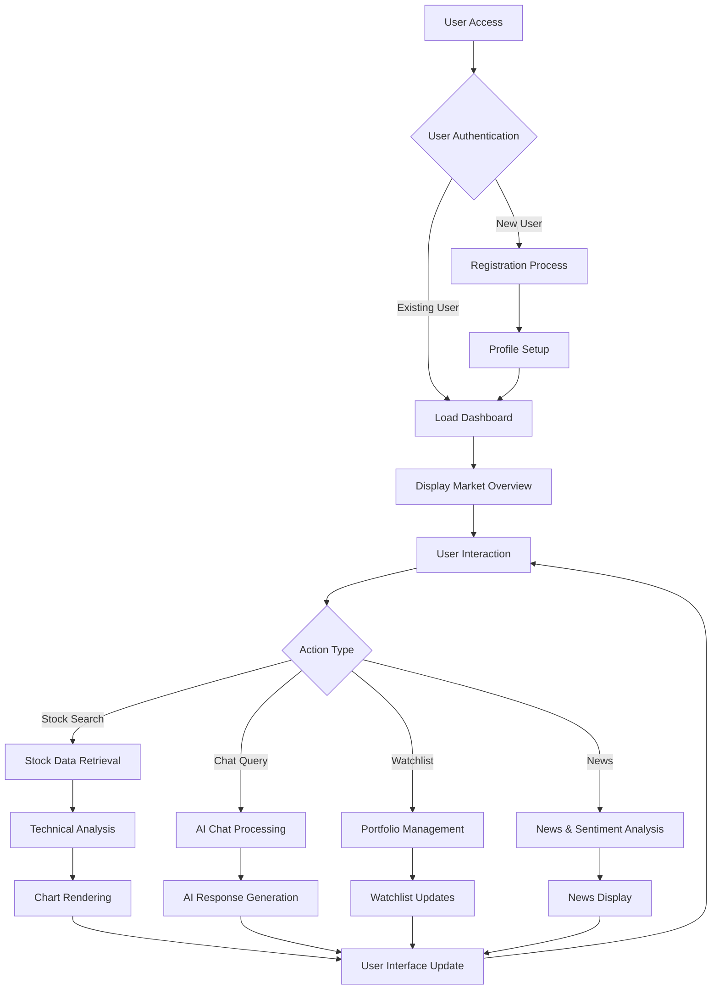

### Real-time Data Update Workflow

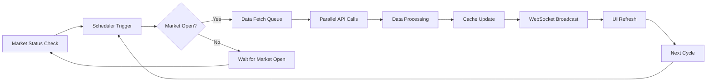

## Data Flow Architecture

### Frontend Data Flow Pattern

```
User Interaction
       ↓
Event Handler (React)
       ↓
State Update Trigger
       ↓
TanStack Query (useQuery/useMutation)
       ↓
HTTP Request to Backend
       ↓
API Response Processing
       ↓
Cache Update (stale-while-revalidate)
       ↓
React State Update
       ↓
Component Re-render
       ↓
UI Update with New Data
```

### Backend Data Processing Flow

```
API Request Receipt
       ↓
Request Validation & Authentication
       ↓
Route Handler Execution
       ↓
Service Layer Business Logic
       ↓
Data Source Selection (Cache vs External API)
       ↓
Data Processing & Transformation
       ↓
Business Logic Application
       ↓
Response Formatting
       ↓
Cache Update (if applicable)
       ↓
HTTP Response to Client
```

### Database Transaction Flow

```
Database Request
       ↓
Connection Pool Management
       ↓
Transaction Begin
       ↓
SQL Query Execution
       ↓
Data Validation
       ↓
Business Rule Enforcement
       ↓
Commit/Rollback Decision
       ↓
Connection Return to Pool
       ↓
Response to Service Layer
```

## Component Interaction Workflows

### Stock Data Retrieval Workflow

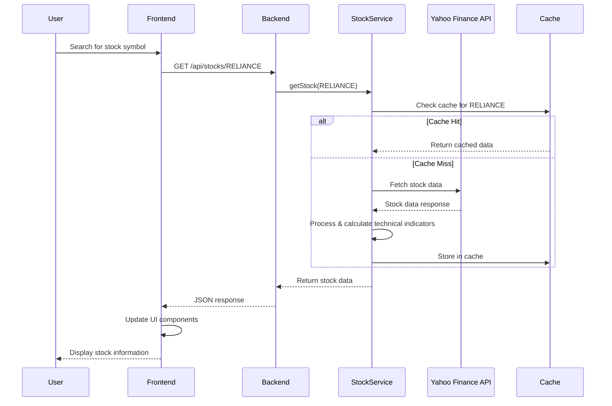

### Chat Processing Workflow

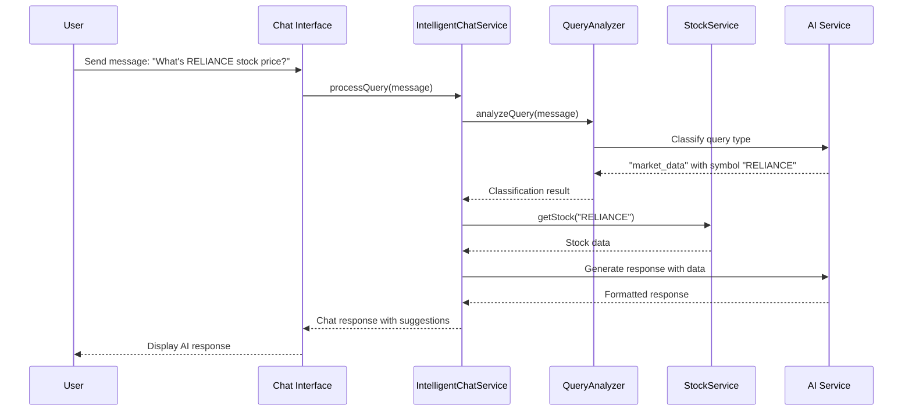

## AI Processing Workflows

### 5-Step Intelligent Query Workflow

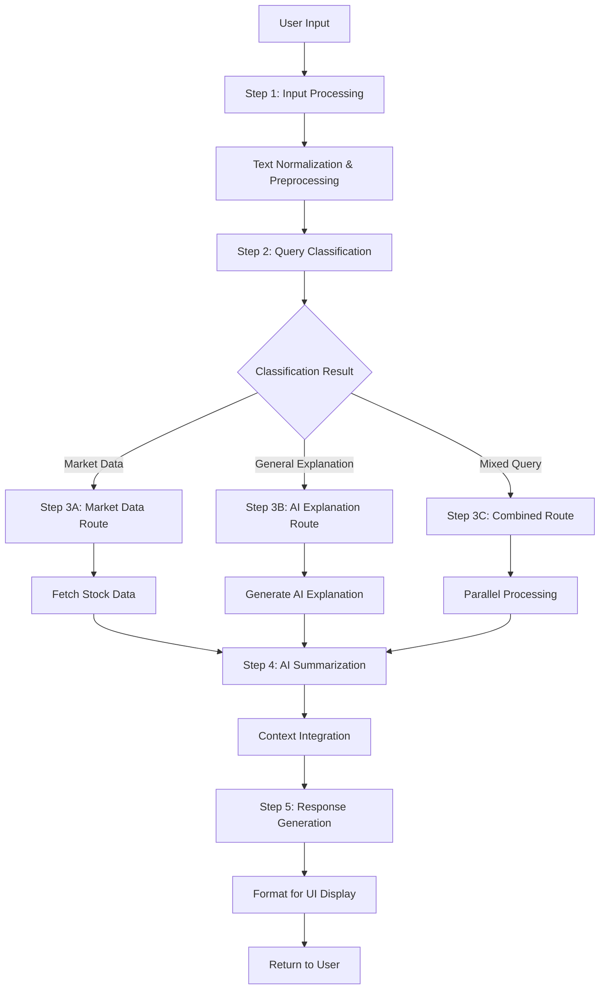

### AI Provider Fallback Strategy

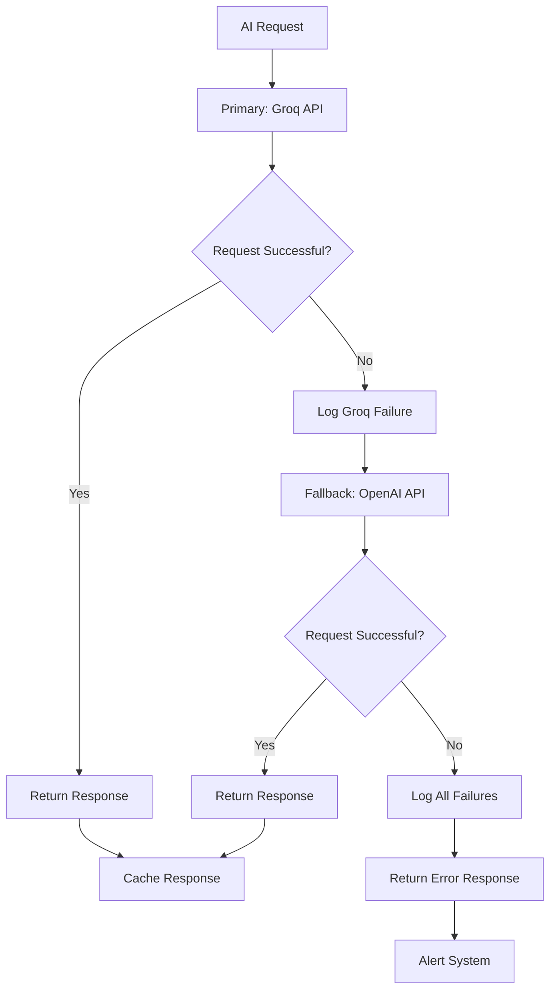

## Integration Workflows

### External Widget Integration Flow

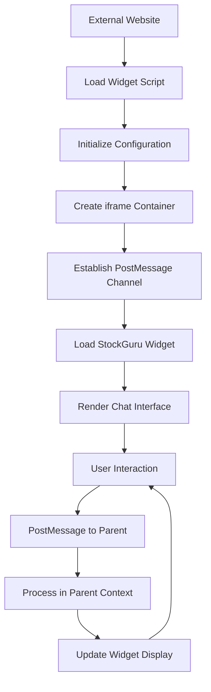

### API Integration Workflow

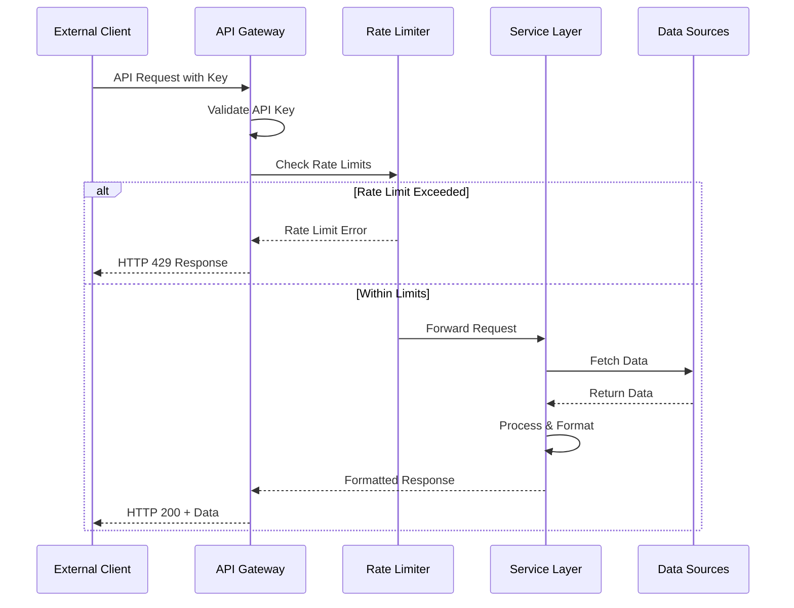

## User Journey Workflows

### New User Onboarding Journey

```
Landing Page
     ↓
Sign Up Process
     ↓
Email Verification
     ↓
Profile Setup
     ↓
Dashboard Introduction
     ↓
First Stock Search
     ↓
Tutorial Overlay
     ↓
Watchlist Creation
     ↓
Chat Interface Demo
     ↓
Feature Discovery
     ↓
Regular Usage Pattern
```

### Daily User Workflow

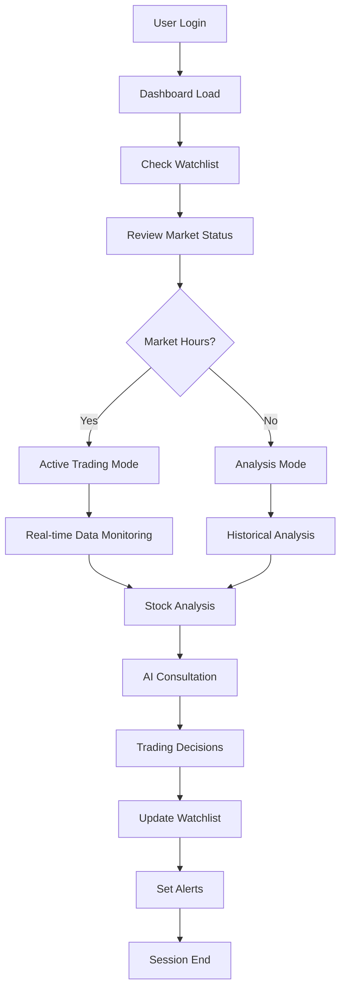

## Deployment & Infrastructure Workflows

### Replit Deployment Workflow

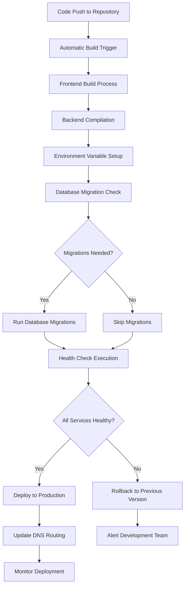

### System Health Monitoring Workflow

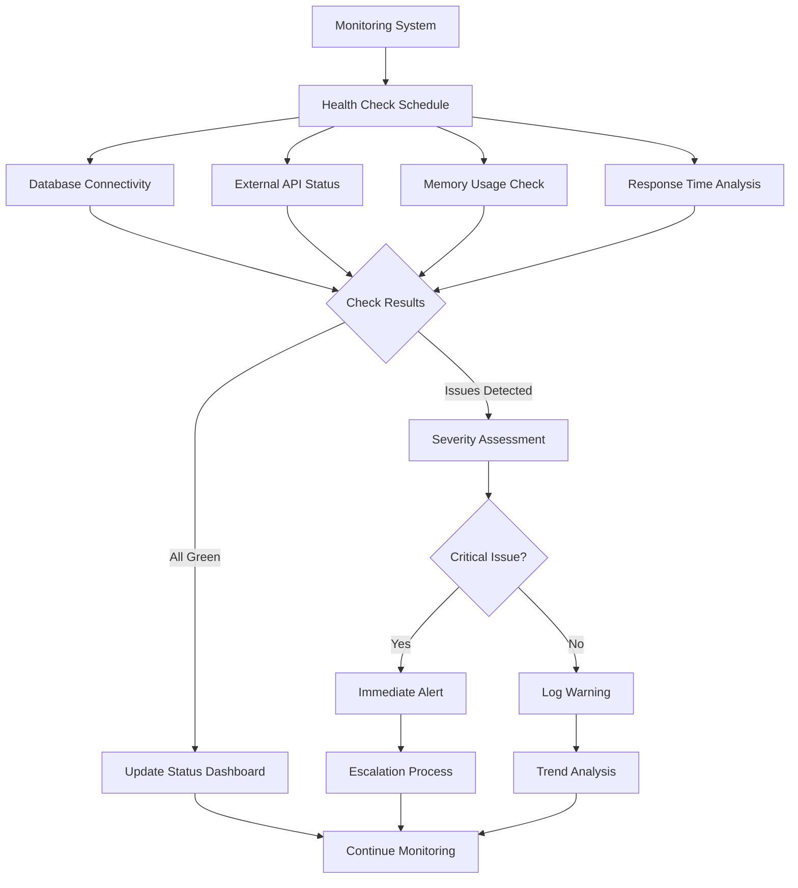

### Error Handling & Recovery Workflow

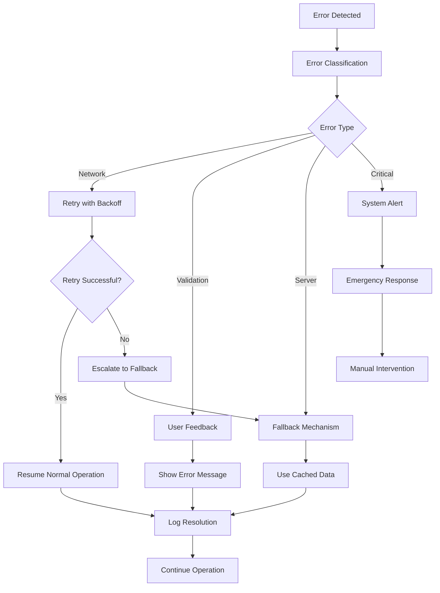

This comprehensive workflow and architecture design document provides detailed visual representations and explanations of how StockGuru operates at various levels, from user interactions to system-level processes, without including any code snippets. The diagrams illustrate the flow of data, user journeys, and system interactions that make the platform function effectively.

